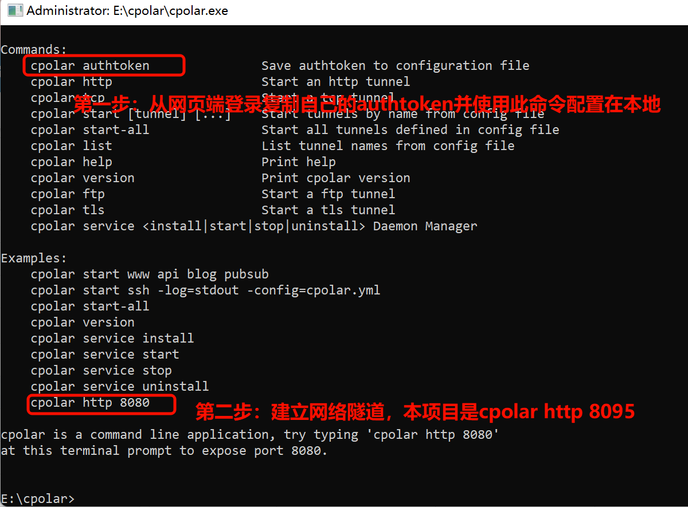
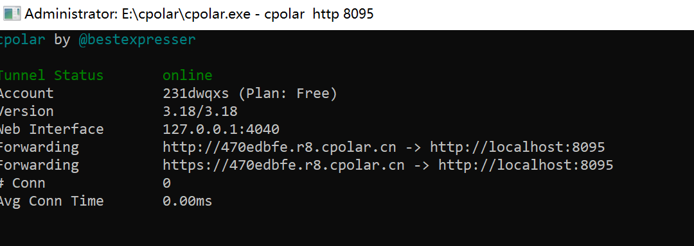
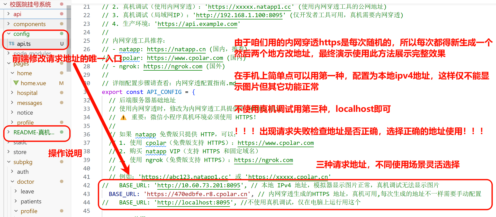
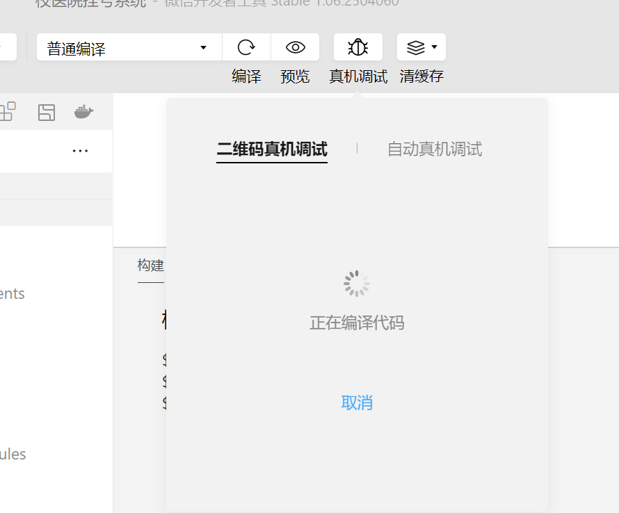

# 真机调试快速开始

## 🚀 5 分钟快速配置

### 1. 安装 cpolar

- 访问：https://www.cpolar.com
- 注册账号并下载 Windows 客户端

### 2. 创建 HTTPS 隧道

配置authtoken只需操作一次



建立成功！如果卡住关掉梯子再建立，接下来按照3，4步分别更改代码里的请求地址和微信开发者工具配置即可成功使用并正常显示图片。



### 3. 修改配置

**`config/api.ts`：**

```typescript
BASE_URL: 'https://xxxxx.cpolar.cn'  // 替换为你的 cpolar 地址
```



### 4. 配置微信小程序合法域名

我是管理员可以，不知道你们有权限配置不

登录 https://mp.weixin.qq.com → 开发 → 开发管理 → 开发设置 → 服务器域名

添加以下三个域名（都使用 HTTPS）：
- request合法域名：`https://xxxxx.cpolar.cn`
- uploadFile合法域名：`https://xxxxx.cpolar.cn`
- downloadFile合法域名：`https://xxxxx.cpolar.cn`

### 5. 重新编译并测试

- 确保后端运行在 `127.0.0.1:8095`

- 确保 cpolar 正在运行

- 重新编译小程序

- 真机调试测试

- 扫码即可在手机上使用

  

## ⚠️ 重要提示

1. **必须使用 HTTPS**（HTTP 无法配置合法域名）
2. **三个域名都要配置**（request、uploadFile、downloadFile）
3. **以真机为准**（模拟器能显示不代表真机也能显示）

